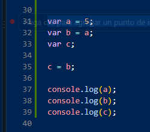
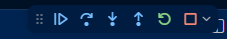
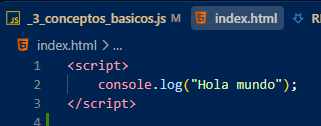

# freecodecamp-Curso_JavaScript

## Antes de usar en VSCode
1. __Instala Node.LTS__
 
Objetivo: Entorno de ejecución para que vs code entienda JavaScript en mi computadora.
  
[página instalar Node](https://nodejs.org/es)

1. __Depurar o mostrar código__
    
    2.2 **<u>Visual con node</u>**
         En la terminal coloca node __nombre_archivo.js__ luego Enter  
    2.2 **<u>Visual depuración</u>**
          - En la sección izquierda del menú selecciona __Ejecución y depuración__ luego en la terminal ve a __consola de depuración__ y le das F5 o ejecución de depuración.
          - Si quieres ver el paso a paso marca con un punto rojo en línea que quieres ver correr 
         
        luego le oprimes F5 o iniciar depuración y en la parte superiro controlas los tiempos y formas como quieres ver correr el programa 
          
    2.3 **<u>por chrome</u>**
         Creas un archivo normal .html y luego le añades la etiqueta __script__ y dentro de ella añades el código en JavaScript 
        
